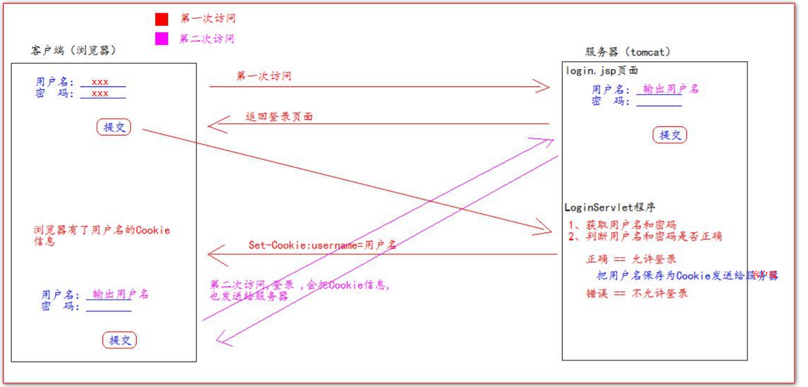

# Cookie

> 饼干

## 什么是Cookie

1. Cookie翻译过来是饼干的意思。
2. Cookie是服务器通知客户端保存键值对的一种技术。
3. 客户端有了Cookie后，每次请求都发送给服务器。
4. 每个Cookie的大小不能超过4kb.

## 如何创建Cookie


Servlet程序中的代码

```java
    protected void createCookie(HttpServletRequest req, HttpServletResponse resp) throws ServletException, IOException {
        // 1. 创建Cookie对象
        Cookie cookie1 = new Cookie("key1", "value1");
        // 2. 通知客户端保存Cookie
        resp.addCookie(cookie1);
        // 1. 创建Cookie对象
        Cookie cookie2 = new Cookie("key2", "value2");
        // 2. 通知客户端保存Cookie
        resp.addCookie(cookie2);

        resp.getWriter().write("Cookie创建成功！");
    }
```

## 服务器如何获取Cookie

服务器获取客户端的Cookie只需要一行代码：`req.getCookies():Cookir[]`


CookiesUtil工具类

```java
public class CookieUtils {

    /**
     * 查找指定名称的Cookie对象
     * @param name
     * @param cookies
     * @return
     */
    public static Cookie finCookie(String name,Cookie[] cookies) {
        if (name == null || cookies == null || cookies.length == 0) {
            return null;
        }
        for (Cookie cookie : cookies) {
            if (name.equals(cookie.getName())) {
                return cookie;
            }
        }
        return null;
    }

}
```

Servlet程序中的代码

```java
    protected void getCookie(HttpServletRequest req, HttpServletResponse resp) throws ServletException, IOException {
        Cookie[] cookies = req.getCookies();


        for (Cookie cookie : cookies) {
            // getName方法，返回Cookie的key(名)
            // getValue方法，返回Cookie的value(值)
            resp.getWriter().write("Cookie【" + cookie.getName() + "=" + cookie.getValue() + "】<br/>");
        }

        Cookie iWantCookie = CookieUtils.finCookie("key1",cookies);

        // 如果不等于null，说明赋过值，也就是找到了需要的Cookie
        if (iWantCookie != null) {
            resp.getWriter().write("找到了需要的Cookie");
        }
    }
```

## Cookie值的修改

### 方案一：

1. 先创建一个要修改的同名的Cookie对象
2. 在构造器，同时赋予新的Cookie值。
3. 在调用response.addCookie(Cookie);

```java
//1. 先创建一个要修改的同名的Cookie对象
//2. 在构造器，同时赋予新的Cookie值。
Cookie cookie = new Cookie("key1","newCookie");
//3. 在调用response.addCookie(Cookie);通知客户端保存修改
resp.addCookie(cookie);
resp.getWriter().write("key1的Cookie修改好了");
```

### 方案二：

1. 先查找需要修改的Cookie对象
2. 调用setValue()方法赋予新的Cookie值。
3. 调用response.addCookie()通知客户端保存修改。

```java
//1. 先查找需要修改的Cookie对象
Cookie cookie = CookieUtils.finCookie("key2", req.getCookies());
//2. 调用setValue()方法赋予新的Cookie值。
cookie.setValue("newValue2");
//3. 调用response.addCookie()通知客户端保存修改。
resp.addCookie(cookie);
```

## Cookie生命控制

> Cookie的声明控制值得是如何管理Cookie什么时候被销毁（删除）

**setMaxAge()**

正数：表示在指定的秒数后过期

负数：表示浏览器一关，Cookie就会被删除（默认值是-1）

零：表示马上删除Cookie

```java
/**
 * Cookie 3600s 后删除
 * @param req
 * @param resp
 * @throws ServletException
 * @throws IOException
 */
protected void life3600(HttpServletRequest req, HttpServletResponse resp) throws ServletException, IOException {
    Cookie cookie = CookieUtils.finCookie("key2", req.getCookies());
    cookie.setMaxAge(60 * 60); // 表示马上删除
    resp.addCookie(cookie);
    resp.getWriter().write("key2的Cookie在3600s后被删除");
}

/**
 * Cookie立即删除
 * @param req
 * @param resp
 * @throws ServletException
 * @throws IOException
 */
protected void deleteNow(HttpServletRequest req, HttpServletResponse resp) throws ServletException, IOException {
    Cookie cookie = CookieUtils.finCookie("key1", req.getCookies());
    cookie.setMaxAge(0); // 表示马上删除
    resp.addCookie(cookie);
    resp.getWriter().write("key1的Cookie被删除");
}

/**
 * Cookie的默认存活时间
 * @param req
 * @param resp
 * @throws ServletException
 * @throws IOException
 */
protected void defaultLife(HttpServletRequest req, HttpServletResponse resp) throws ServletException, IOException {
    Cookie cookie = new Cookie("defaultLife", "defaultLife");
    cookie.setMaxAge(-1); // 设置存活时间
    resp.addCookie(cookie);
}
```

## Cookie有效路径Path的设置

Cookie的Path属性可以有效的过滤哪些Cookie可以发送给服务器，哪些不发。

path属性是通过请求的地址来进行有效过滤。

| CookieA | path=/工程路径     |
| ------- | ------------------ |
| CookieB | path=/工程路径/abc |

请求地址如下：

http://ip:port/工程路径/a.html

+ CookieA发送
+ CookieB不发送

http://ip:port/工程路径/abc/a.html

+ CookieA发送
+ CookieB发送

## Cookie练习

