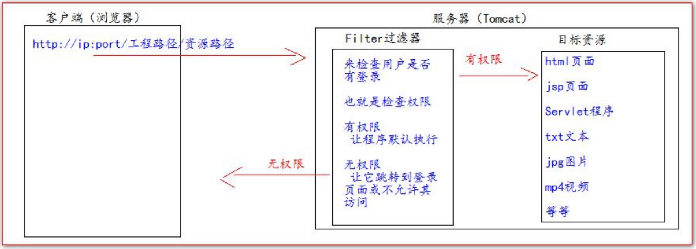
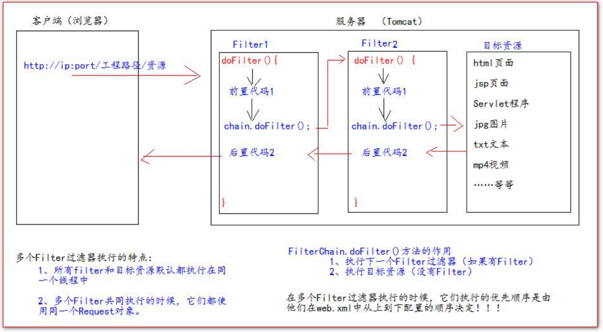

# Filter过滤器

1. Filter过滤器它是JavaWeb的三大组件之一。三大组件分别是：Servlet程序、Listener监听器、Filter过滤器
2. Filter过滤器它是JavaEE的规范，也就是接口。
3. Filter过滤器它的作用是：拦截请求，过滤响应。


拦截请求常见的应用场景有：

1. 权限检查
2. 日记操作
3. 事务管理等等。


# Filter的初体验

要求：在你的web工程下，有一个admin目录。这个admin目录下的所有资源（HTML页面、jpg图片、jsp文件、等等）都必须是用户登录之后才允许访问。

思考：根据之前我们学过内容。我们直到，用户登录之后都会把用户登录的信息都保存到Session域中。所以要检查用户是否登录，可以判断Session中是否包含有用户登录的信息即可！！！

```jsp
<%
Object user = session.getAttribute("user");
// 如果等于null。则说明没有登陆
if (user == null) {
    request.getRequestDispatcher("/login.jsp").forward(request,response);
}
%>
```

## Filter的工作流程图



**Filter的代码**

```java
public class AdminFilter implements Filter {
    @Override
    public void init(FilterConfig filterConfig) throws ServletException {

    }

    /**
     * doFilter方法，专门用来拦截请求。可以做权限检查
     *
     * @param servletRequest
     * @param servletResponse
     * @param filterChain
     * @throws IOException
     * @throws ServletException
     */
    @Override
    public void doFilter(ServletRequest servletRequest, ServletResponse servletResponse, FilterChain filterChain) throws IOException, ServletException {
        HttpServletRequest httpServletRequest = (HttpServletRequest) servletRequest;
        HttpSession session = httpServletRequest.getSession();
        Object user = session.getAttribute("user");

        if (user == null) {
            servletRequest.getRequestDispatcher("/login.jsp").forward(servletRequest, servletResponse);
            return;
        } else {
            // 让程序继续往下访问用户的目标资源
            filterChain.doFilter(servletRequest, servletResponse);
        }


    }

    @Override
    public void destroy() {

    }
}
```

**web.xml中的配置**

```xml
    <!--filter标签用于配置一个Filter过滤器-->
    <filter>
        <!--给Filter起一个别名-->
        <filter-name>AdminFilter</filter-name>
        <!--给Filter配置一个全类名-->
        <filter-class>com.zh.filter.AdminFilter</filter-class>
    </filter>

    <!--filter-mapping配置Filter过滤器的拦截路径-->
    <filter-mapping>
        <!--filter-name表示当前的拦截路径给哪个filter使用-->
        <filter-name>AdminFilter</filter-name>
        <!--
            url-pattern配置拦截路径
            / 表示请求地址为：http://ip:port/工程路径/  映射到IDEA的web路径
            /admin/*  表示请求地址为：http://ip:port/工程路径/admin/*
        -->
        <url-pattern>/admin/*</url-pattern>
    </filter-mapping>
```

## Filter过滤器的使用步骤

1. 编写一个类去实现Filter接口
2. 实现过滤方法**doFilter()**
3. 到web.xml中去配置Filter的拦截路径

# Filter的生命周期

**Filter的声明周期包含几个方法**

1. 构造器方法
2. init初始化方法
   + 第1、2步，在web工程启动的时候执行（Filter已经创建）

3. doFilter过滤器
   + 第3步，每次拦截到请求，就会执行
4. destroy销毁
   + 第4步，停止web工程的时候，就会执行（停止web工程，也会销毁Filter过滤器）

# FilterConfig类

1. FilterConfig类见名知义，它是Filter过滤器的配置文件类。
2. Tomcat每次创建Filter的时候，也会同时创建一个FilterConfig类，这里包含了Filter配置文件的配置信息。
3. FilterConfig类的作用是获取Filter过滤器的配置内容
   + 获取Filter的名称**filter-name**的内容
   + 获取在Filter中配置的**init-param**初始化参数
   + 获取ServletContext对象

**java代码**

```java
 @Override
    public void init(FilterConfig filterConfig) throws ServletException {
        System.out.println("2. AdminFilter.init");
        //+ 获取Filter的名称**filter-name**的内容
        System.out.println("filter-name的值是：" + filterConfig.getFilterName());
        //+ 获取在web.xml中配置的**init-param**初始化参数
        System.out.println("初始化参数username是：" + filterConfig.getInitParameter("username"));
        System.out.println("初始化参数url是：" + filterConfig.getInitParameter("url"));
        //+ 获取ServletContext对象
        System.out.println("ServletContext对象：" + filterConfig.getServletContext());
    }
```


**web.xml配置**

```xml
    <!--filter标签用于配置一个Filter过滤器-->
    <filter>
        <!--给Filter起一个别名-->
        <filter-name>AdminFilter</filter-name>
        <!--给Filter配置一个全类名-->
        <filter-class>com.zh.filter.AdminFilter</filter-class>

        <init-param>
            <param-name>username</param-name>
            <param-value>root</param-value>
        </init-param>

        <init-param>
            <param-name>url</param-name>
            <param-value>jdbc:mysql://localhost:3306/test</param-value>
        </init-param>
    </filter>

    <!--filter-mapping配置Filter过滤器的拦截路径-->
    <filter-mapping>
        <!--filter-name表示当前的拦截路径给哪个filter使用-->
        <filter-name>AdminFilter</filter-name>
        <!--
            url-pattern配置拦截路径
            / 表示请求地址为：http://ip:port/工程路径/  映射到IDEA的web路径
            /admin/*  表示请求地址为：http://ip:port/工程路径/admin/*
        -->
        <url-pattern>/admin/*</url-pattern>
    </filter-mapping>
```


# FilterChain过滤器链

Filter：过滤器

Chain：链，链条

FilterChain就是过滤器链（多个过滤器如何一起工作）



# Filter的拦截路径

## 精确匹配

==<url-pattern>/target.jsp</url-pattern>==

以上配置的路径，表示请求地址必须为：http://ip:port/工程路径/target.jsp

## 目录匹配

==<url-pattern>/admin/*</url-pattern>==

以上配置的路径，表示请求地址必须为：http://ip:port/工程路径/admin/*

## 后缀名匹配

==<url-pattern>*.html</url-pattern>==

以上配置的路径，表示请求地址必须以**.html**结尾才会拦截到

==<url-pattern>*/do</utl-pattern>==

以上配置的路径，表示请求地址必须以**.do**结尾才会拦截到

==<url-pattern>*.action</utl-pattern>==

以上配置的路径，表示请求地址必须以***.action**结尾才会拦截到


Filter过滤器它只关心请求的地址是否匹配，不关心请求的资源是否存在！！！


# ThreadLocal

1. ThreadLoal的作用，他可以解决多线程的数据安全问题。
2. TheadLoacl他可以给当前线程关联一个数据（可以是普通变量，可以是对象，也可以是数据，集合）

3. ThreadLocal的特点：
   + ThreadLocal可以为当前线程关联一个数据。（他可以像Map一样存取数据，key为当前线程）
   + 每一个ThreadLocal对象，**只能为当前线程关联一个数据**（要想关联多个，必须new多个ThreadLocal），如果要为当前线程关联多个数据，就需要使用多个ThreadLocal对象实例
   + 每个ThreadLocal 对象实例定义的时候，一般都是static类型
   + ThreadLoacl中保存数据，在线程销毁后。会由JVM虚拟机自动释放


# 将所有异常都统一交给Tomcat，让Tomcat展示友好的错误信息页面

在web.xml中我们可以通过错误页面配置来进行管理

