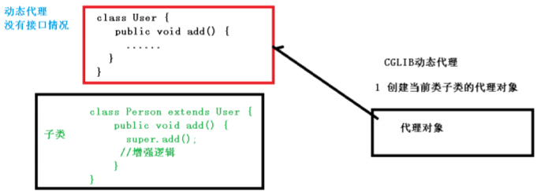
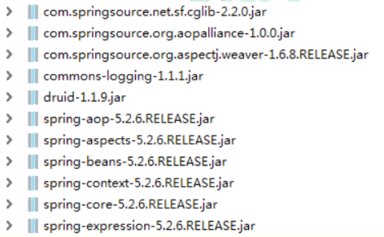

# AOP（概念）

## 什么是AOP

1. AOP：面向切面编程，利用AOP可以对业务逻辑的各个部分进行隔离，从而使得业务逻辑部分之间的耦合度，提高程序的可重用性，同时提高了开发的效率
2. 通俗描述：不通过修改源代码方式，在主干功能里边添加新功能。
3. 使用登录例子说明AOP


# AOP（底层原理）

## AOP底层使用动态代理

> 有两种情况动态代理

### 第一种，有接口情况，使用JDK动态代理

1. 创建接口实现类代理对象，增强类的方法


### 第二种，没有接口情况，使用CGLIB动态代理

1. 创建子类的代理对象，增强类的方法



#  AOP（JDK动态代理）

## 使用JDK动态代理，使用Proxy类里面的方法创建代理对象


1. 调用**newProxyInstance**方法


​	方法有三个参数：

+ 第一个参数，类加载器
+ 第二个参数，增强方法所在的类，这个类实现的接口，支持多个接口。
+ 第三个参数，实现这个接口**InvocationHandler**，创建代理对象，写增强的部分。

## 编写JDK动态代理代码

1. 创建接口，定义方法

   ```java
   public interface UserDao {
   
       public int add(int a, int b);
   
       public String update(String id);
   
   }
   ```

   

2. 创建接口实现类，实现方法

   ```java
   public class UserDaoImpl implements UserDao {
       public int add(int a, int b) {
           return a + b;
       }
   
       public String update(String id) {
           return id;
       }
   }
   ```

3. 使用Proxy类创建接口代理对象

   ```java
   public class JDKProxy {
   
       public static void main(String[] args) {
           // 创建接口实现类代理对象
           Class[] interfaces = {UserDao.class};
           //Proxy.newProxyInstance(JDKProxy.class.getClassLoader(), interfaces, new InvocationHandler() {
           //    public Object invoke(Object proxy, Method method, Object[] args) throws Throwable {
           //        return null;
           //    }
           //});
           UserDao userDao = new UserDaoImpl();
           UserDao userDao1 = (UserDao) Proxy.newProxyInstance(JDKProxy.class.getClassLoader(), interfaces, new UserDaoProxy(userDao));
           System.out.println("执行结果" + userDao1.add(1, 2));
       }
   
   }
   
   // 创建代理对象的方法
   class UserDaoProxy implements InvocationHandler{
       // 1. 把创建的是谁的代理对象，把谁传递过来
       // 有参构造
       private Object obj;
   
       public UserDaoProxy(Object obj) {
           this.obj = obj;
       }
   
   
       // 增强业务的逻辑
       @Override
       public Object invoke(Object proxy, Method method, Object[] args) throws Throwable {
           // 方法之前
           System.out.println("方法执行之前执行...." + method.getName() + " ....传递的而参数" + Arrays.toString(args));
   
           // 被增强的方法执行
           Object res = method.invoke(obj, args);
   
   
           // 方法执行之后执行
           System.out.println("方法执行之后输出。。。" + obj);
   
   
           return res;
       }
   }
   ```

# AOP（术语）

1. 连接点
   + 类里面哪些方法可以被增强，这些方法称为连接点
2. 切入点
   + 实际被真正增强的方法，称为切入点
3. 通知（增强）
   1. 实际增强的部分被称为通知（增强）
   2. 通知有多种类型
      + 前置通知
      + 后置通知
      + 环绕通知
      + 异常通知
      + 最终通知
4. 切面
   + 是动作，把通知应用到切入点过程

# AOP操作（准备工作）

## Spring框架一般都是基于AspectJ实现AOP操作

1. AspectJ不是Spring组成部分，独立AOP框架，一般把AspectJ和Spring框架一块儿使用，进行AOP操作。

## 基于AspectJ实现AOP操作

1. 基于xml注解方式实现
2. 基于注解方式实现（使用）

## 在项目工程里面引入AOP相关依赖



```xml

```

## 切入点表达式

1. 切入点表达式作用：知到对哪个类里面的方法进行增强
2. 语法结构：`execution([权限修饰符][返回类型][类全路径][方法名称]([参数列表]))`
   1. 举例1：对com.zh.dao.BookDao类里面的add进行增强，`execution(* com.zh.dao.BookDao.add(..))`
   2. 举例2：对com.zh.dao.BookDao类里面所有的方法及逆行增强，`execution(* com.zh.dao.BookDao.*(..))`
   3. 举例3：对com.zh.dao包里面所有类，类的所有方法进行增强，`execution(* com.zh.dao.*.*(..))`

# AOP操作（AspectJ注解）

## 创建类，在类里面定义方法

```java
public class User {

    public void add() {
        System.out.println("User.add");
    }

}
```


## 创建增强类（编写增强逻辑）

```java
public class UserProxy {
    public void before() {
        System.out.print("UserProxy.brfore");
    }
}
```


## 进行通知的配置

### 在spring配置文件中，开启注解扫描

```xml
<beans xmlns="http://www.springframework.org/schema/beans"
       xmlns:xsi="http://www.w3.org/2001/XMLSchema-instance"
       xmlns:context="http://www.springframework.org/schema/context"
       xmlns:aop="http://www.springframework.org/schema/aop"
       xsi:schemaLocation="http://www.springframework.org/schema/beans http://www.springframework.org/schema/beans/spring-beans.xsd
                            http://www.springframework.org/schema/context http://www.springframework.org/schema/context/spring-context.xsd
                            http://www.springframework.org/schema/aop http://www.springframework.org/schema/aop/spring-aop.xsd">

    <!--开启注解的扫描-->
    <context:component-scan base-package="com.zh.spring5.aopanno"></context:component-scan>
```


### 使用注解创建User和UserProxy对象

```java
@Component
public class User {

    public void add() {
        System.out.println("User.add");
    }

}

@Component
public class UserProxy {
    public void before() {
        System.out.print("UserProxy.brfore");
    }
}
```

### 在增强类上面添加注解@Aspect

```java
@Component
@Aspect // 生成代理对象
public class UserProxy {
```

### 在spring配置文件中开启生成代理对象

```xml
<!--生成Aspect生成代理对象-->
<aop:aspectj-autoproxy></aop:aspectj-autoproxy>
```


## 配置不同类型的通知

```java
@Component
@Aspect // 生成代理对象
public class UserProxy {

    // 前置通知
    // @Before注解表示作为前置通知
    @Before(value = "execution(* com.zh.spring5.aopanno.User.add(..))")
    public void before() {
        System.out.println("UserProxy.before");
    }

    // 最终通知
    @After(value = "execution(* com.zh.spring5.aopanno.User.add(..))")
    public void after() {
        System.out.println("UserProxy.after");
    }

    // 返回通知（返回通知）
    @AfterReturning(value = "execution(* com.zh.spring5.aopanno.User.add(..))")
    public void afterReturning() {
        System.out.println("UserProxy.afterReturning");
    }

    // 异常通知
    @AfterThrowing(value = "execution(* com.zh.spring5.aopanno.User.add(..))")
    public void afterThrowing() {
        System.out.println("UserProxy.afterThrowing");
    }

    // 环绕通知
    @Around(value = "execution(* com.zh.spring5.aopanno.User.add(..))")
    public void around(ProceedingJoinPoint proceedingJoinPoint) throws Throwable {
        System.out.println("UserProxy.around之前");

        // 被增强的方法执行
        proceedingJoinPoint.proceed();

        System.out.println("UserProxy.around之后");
    }


}
```


## 相同的接入点的抽取

```java
@Component
@Aspect // 生成代理对象
public class UserProxy {

    // 相同切入点抽取
    @Pointcut(value = "execution(* com.zh.spring5.aopanno.User.add(..))")
    public void pointDemo() {
    }


    // 前置通知
    // @Before注解表示作为前置通知
    @Before(value = "pointDemo()")
    public void before() {
        System.out.println("UserProxy.before");
    }
}
```

## 有多个增强类多同一个方法进行增强，设置增强类优先级

1. 在增强类上面添加注解==@Order(数字类型值)==，数字类型值越小优先级越高

```java
@Component
@Aspect
@Order(1)
public class PersonProxy {
```

## 完全使用注解开发

> 创建配置类，不需要创建xml配置文件

```java
@Configuration
@ComponentScan(basePackages = {"com.zh"})
@EnableAspectJAutoProxy(proxyTargetClass = true)
public class ConfigAop {
}
```


# AOP操作（AspectJ配置文件）

## 创建两个类，增强类和被增强类，创建方法


## 在Spring配置文件中创建两个类对象

```xml
<!--创建对象-->
<bean id="book" class="com.zh.spring5.aopxml.Book"></bean>
<bean id="bookProxy" class="com.zh.spring5.aopxml.BookProxy"></bean>
```


## 在Spring配置文件中配置切入点

```xml
<!--配置AOP增强-->
<aop:config>
    <!--切入点-->
    <aop:pointcut id="p" expression="execution(* com.zh.spring5.aopxml.Book.buy(..))"/>

    <!--配置切面-->
    <aop:aspect ref="bookProxy">
        <!--增强作用在具体的方法上-->
        <aop:before method="before" pointcut-ref="p"></aop:before>
    </aop:aspect>
</aop:config>
```


