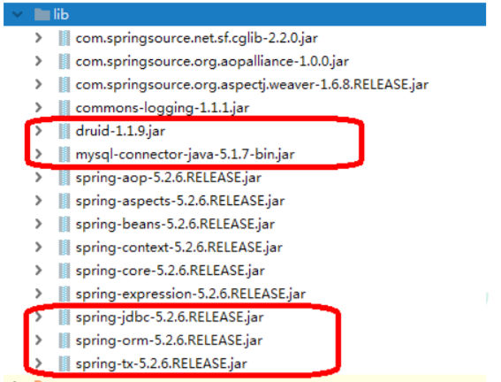

# JdbcTemplate（概念和准备）

## 什么是JdbcTemplate

> Spring框架对JDBC进行封装，使用JdbcTemplate方便实现对数据库操作

## 准备工作

### 引入相关的jar包



### 在spring配置文件配置数据库连接池

```xml
<!--数据库连接池-->
<bean id="dataSource" class="com.alibaba.druid.pool.DruidDataSource">
    <property name="url" value="jdbc:mysql://localhost:3306/test"></property>
    <property name="username" value="root"></property>
    <property name="password" value="root"></property>
    <property name="driverClassName" value="com.mysql.jdbc.Driver"></property>
</bean>
```


### 配置JdbcTemplate对象，注入DataSource

```xml
<!--JdbcTemplate对象-->
<bean id="jdbcTemplate" class="org.springframework.jdbc.core.JdbcTemplate">
    <!--注入dataSource-->
    <property name="dataSource" ref="dataSource"></property>
</bean>
```


### 创建service类，创建dao类，在dao注入jdbcTemplate对象

#### 配置文件

```xml
<!--开启组件扫描-->
<context:component-scan base-package="com.zh"></context:component-scan>
```


#### Service

```java
@Service
public class BookService {

    // 注入dao
    @Autowired
    private BookDao bookDao;

}
```


#### Dao

```java
@Repository
public class BookDaoImpl implements BookDao {

    // 注入JdbcTemplate对象
    @Autowired
    private JdbcTemplate jdbcTemplate;

}
```

# JdbcTemplate操作数据库（添加）

