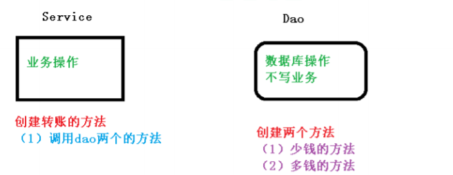
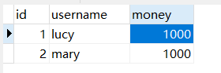

# 事务操作（事务概念）

## 什么是事务

1. 事务时数据库操作最基本单元，逻辑上一组操作，要么都成功。如果有一个失败所有操作都失败。
2. 典型场景：银行转账
   + lucy转账100员给mary
   + lucy少了100，mary多了100

## 事务四个特性（ACID）

1. 原子性：过程不可分割，要么都成功，要么不成功
2. 一致性：操作之前和操作之后的总量是不变的
3. 隔离性：在多事物操作的时候不会产生影响
4. 持久性：事务提交之后，数据发生变化


# 事务操作（搭建事务操作环境）



## 创建数据库表，添加记录



## 创建service，搭建dao，完成对象创建和注入关系

> service注入dao，在dao注入JdbcTemplate，在JdbcTemplate注入DataSource

```java
@Service
public class UserService {

    // 注入dao
    @Autowired
    private UserDao userDao;

}

@Repository
public class UserDaoImpl implements UserDao{

    @Autowired
    private JdbcTemplate jdbcTemplate;

}
```

## 在dao创建两个方法：多钱和少钱的方法，在service创建方法（转账的方法）

```java
@Repository
public class UserDaoImpl implements UserDao{

    @Autowired
    private JdbcTemplate jdbcTemplate;

    public void reduceMoney() {
        String sql = "update t_account set money = money - ? where username = ?";
        jdbcTemplate.update(sql, 100, "lucy");
    }

    public void addMoney() {
        String sql = "update t_account set money = money + ? where username = ?";
        jdbcTemplate.update(sql,100, "mary");
    }
}


@Service
public class UserService {

    // 注入dao
    @Autowired
    private UserDao userDao;

    public void accountMoney() {
        userDao.reduceMoney();
        userDao.addMoney();
    }

}
```

